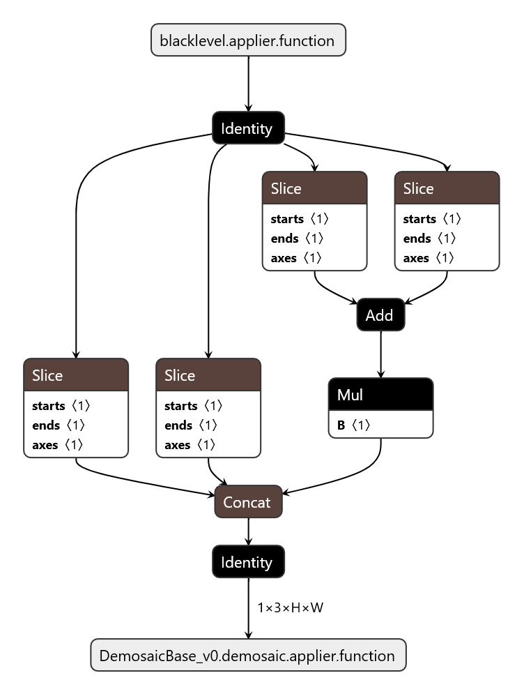
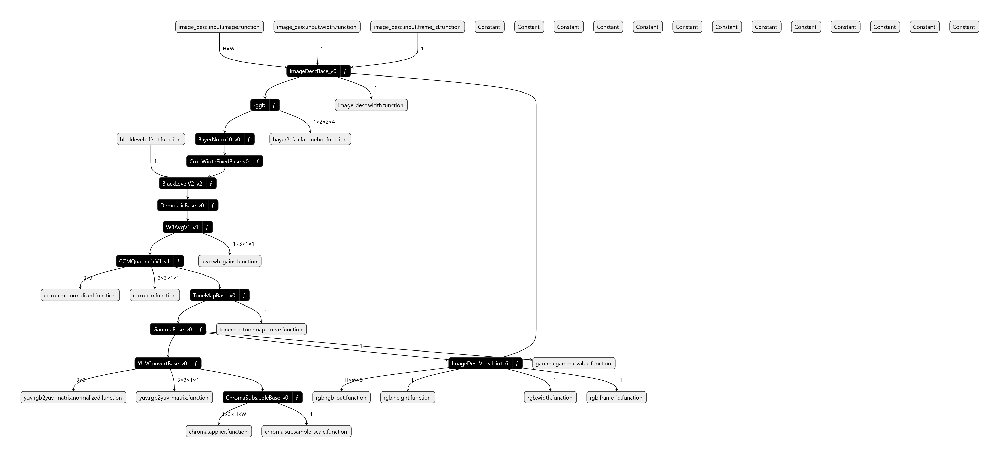

  [](https://github.com/geobang/softisp/actions/workflows/main.yml)
### Project Overview
**SoftISP** is a simple, open software image signal processor. It converts raw camera sensor data into clean, color-correct images using readable, modular code. The goal is to make image processing easy to understand, test, and extend for developers, researchers, and hobbyists.

---

### What It Does
- **Input**: raw sensor frames such as Bayer data.  
- **Processing**: a chain of small stages like black level correction, demosaic, white balance, color correction, tone mapping, and gamma.  
- **Output**: standard image files or tensors ready for display or further processing.  

**Why it matters**  
- Lets people experiment with camera algorithms without special hardware.  
- Makes results reproducible and easy to compare.  
- Serves as a learning tool and a testbed for research.

---

### How It Works
- **Modular stages**: each processing step is a separate block with a clear input and output. You can swap or replace stages without changing the rest of the pipeline.  
- **Readable code**: functions use plain names and short, well commented logic so newcomers can follow.  
- **Testable**: every block has unit tests and example inputs so outputs are repeatable and verifiable.  
- **ONNX friendly**: the pipeline can be exported to ONNX for testing in other runtimes.




---

### Quick Start
**Requirements**  
- Python 3.12 or newer.  
- Common packages such as `numpy`, `opencv-python`, and `onnx` listed in `requirements.txt`.

**Install and run**  
```bash
git clone <repo-url>
cd softisp
python -m venv venv
source venv/bin/activate
pip install -r requirements.txt
# run a build onnx script
cd onnx
python build_all.py --mode algo pipeline.json
python build_all.py --mode applier pipeline.json
# test onnx and emulate bayer to yuv
python test_full_pipeline.py --model_dir onnx_out/softisp_pipeline_test
```

**What to expect**  
- The demo runs the full pipeline and ignore output. Optional writes a PNG image to `out/result.png`.  
- Logs show each stage name and a short summary of what happened.

---

### Roadmap
**Short term**  
- Stabilize core stages and add basic unit tests.  (done)
- Provide 2 to 5 example raw images and expected outputs.

**Medium term**  
- Improve accuracy and add more test data (done).  
- Add simple performance improvements and a demo script (done).

**Long term**  
- Add auto exposure and auto white balance tuning(done).  
- Build a small web demo or GUI for non technical users.

**Status**
- Had a complete and simple pipeline(awb,blacklevel,demosaic,ccm,gamma) (done)
- Action builds applier/algo/coordinator onnx for test/analysis (done)
- Harness test script to applier/algo/coordinator (done)

  https://github.com/geobang/softisp/blob/main/onnx/test_full_pipeline.py
---

### Contributing and License
**How to help**  
- Try the code and report bugs.  
- Add a test image or a unit test.  
- Improve documentation or write a short tutorial.

**Guidelines**  
- Keep changes small and focused.  
- Add tests for new behavior.  
- Use clear commit messages.

**License**  
- The project uses a permissive license such as GPLv2 so others can reuse the code.

---

